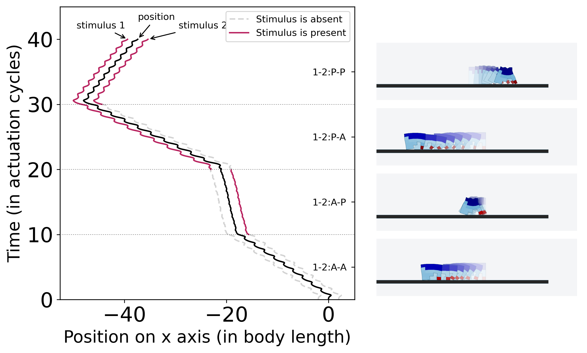

# No-brainer: Adaptive behavior without separately postulated brains

This is the code for the paper [No-brainer: Morphological Computation driven Adaptive Behavior in Soft Robots](https://link.springer.com/chapter/10.1007/978-3-031-71533-4_6) ([arxiv](https://arxiv.org/abs/2407.16613))

# A short summary

We evolve virtual robots that exhibit adaptive behavior (changing the direction of locomotion in response to changes in the stimuli) by using only reactive materials (no separately postulated brains e.g. neural networks). A swarm of such robots, under certain assumptions, could exhibit any computable behavior.

<div align='center'>
</img>
</div>

# Robots in action


https://github.com/mertan-a/no-brainer/assets/34231008/fefa1844-a9ef-4af7-876d-77b9c9df7ac7


[More gifs and videos](robots-in-action)

# Citation

```
@InProceedings{10.1007/978-3-031-71533-4_6,
author="Mertan, Alican
and Cheney, Nick",
editor="Brock, Oliver
and Krichmar, Jeffrey",
title="No-brainer: Morphological Computation Driven Adaptive Behavior in Soft Robots",
booktitle="From Animals to Animats 17",
year="2025",
publisher="Springer Nature Switzerland",
address="Cham",
pages="81--92",
abstract="It is prevalent in contemporary AI and robotics to separately postulate a brain modeled by neural networks and employ it to learn intelligent and adaptive behavior. While this method has worked very well for many types of tasks, it isn't the only type of intelligence that exists in nature. In this work, we study the ways in which intelligent behavior can be created without a separate and explicit brain for robot control, but rather solely as a result of the computation occurring within the physical body of a robot. Specifically, we show that adaptive and complex behavior can be created in voxel-based virtual soft robots by using simple reactive materials that actively change the shape of the robot, and thus its behavior, under different environmental cues. We demonstrate a proof of concept for the idea of closed-loop morphological computation, and show that in our implementation, it enables behavior mimicking logic gates, enabling us to demonstrate how such behaviors may be combined to build up more complex collective behaviors.",
isbn="978-3-031-71533-4"
}
```

